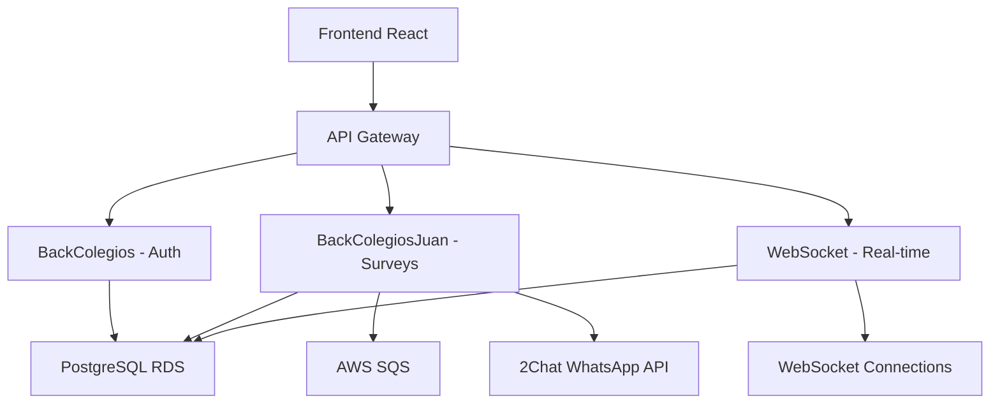

# Backend Colegios - Selva Matemágica

[](https://aws.amazon.com/lambda/)
[](https://python.org)
[](https://postgresql.org)
[](https://fastapi.tiangolo.com/)

Sistema backend completo para la plataforma educativa **Selva Matemágica**, diseñado con arquitectura de microservicios desplegada en AWS. Este proyecto proporciona servicios de autenticación, gestión de usuarios, cuestionarios educativos, mensajería WhatsApp y actualizaciones en tiempo real.

## 📋 Tabla de Contenidos

- [Arquitectura del Proyecto](#-arquitectura-del-proyecto)
- [Componentes del Sistema](#-componentes-del-sistema)
- [Tecnologías Utilizadas](#-tecnologías-utilizadas)
- [Estructura de la Base de Datos](#-estructura-de-la-base-de-datos)
- [Instalación y Configuración](#-instalación-y-configuración)
- [Despliegue en AWS](#-despliegue-en-aws)
- [API Endpoints](#-api-endpoints)
- [WebSocket Events](#-websocket-events)
- [Variables de Entorno](#-variables-de-entorno)
- [Contribución](#-contribución)

## 🏗️ Arquitectura del Proyecto

El sistema está compuesto por **tres microservicios independientes**, cada uno con responsabilidades específicas:

```
Backend_Colegios/
├── BackColegios/          # Autenticación y gestión de usuarios
├── BackColegiosJuan/      # Cuestionarios y mensajería WhatsApp
├── WebSocketBackColegios/ # Actualizaciones en tiempo real
└── README.md
```

### Flujo de Datos



## 🔧 Componentes del Sistema

### 1. BackColegios - Autenticación y Gestión de Usuarios

**Responsabilidades:**
- 🔐 Inicio de sesión y registro de usuarios
- 📧 Recuperación de contraseñas por email
- ✅ Verificación y autorización de cuentas
- 🔒 Gestión de sesiones seguras

**Características:**
- Operaciones estáticas con cambios de página
- Cifrado SHA-256 para contraseñas
- Integración SMTP para notificaciones por email
- Validación de usuarios independiente

### 2. BackColegiosJuan - Cuestionarios y Mensajería

**Responsabilidades:**
- 📊 Gestión de cuestionarios educativos (semanal, mensual, 1-a-1)
- 📱 Integración con WhatsApp via API 2Chat
- 🏫 Gestión de usuarios por colegio
- 📬 Sistema de colas de mensajes con AWS SQS

**Tipos de Cuestionarios:**
- **Primera Semana**: Evaluación inicial del docente
- **Semanal**: Seguimiento semanal del progreso
- **Mensual**: Evaluación mensual detallada
- **1-a-1**: Sesiones individuales de acompañamiento

### 3. WebSocketBackColegios - Actualizaciones en Tiempo Real

**Responsabilidades:**
- 🔄 Actualizaciones en tiempo real para múltiples usuarios
- 👥 Gestión de conexiones WebSocket activas
- 📊 Visualización de datos de usuarios en tablas dinámicas
- 📁 Importación masiva de usuarios via Excel
- 🔄 Sincronización de datos entre usuarios conectados

**Eventos WebSocket:**
- `getusers`: Obtener lista de usuarios
- `get_a_user`: Obtener datos de un usuario específico
- `updateRole`: Actualizar rol de usuario
- `deleteUsers`: Cambiar estado de usuario
- `insertUsers`: Insertar usuarios masivamente

## 🛠️ Tecnologías Utilizadas

### Backend
- **Python 3.9+**
- **FastAPI** - Framework web moderno y rápido
- **pg8000** - Driver PostgreSQL nativo
- **boto3** - SDK de AWS para Python
- **websockets** - Soporte WebSocket
- **hashlib** - Cifrado de contraseñas

### Base de Datos
- **PostgreSQL 13+** - Base de datos principal
- **AWS RDS** - Servicio de base de datos gestionado

### Infraestructura AWS
- **AWS Lambda** - Funciones serverless
- **API Gateway** - Gestión de APIs REST y WebSocket
- **AWS SQS** - Sistema de colas de mensajes
- **AWS RDS** - Base de datos PostgreSQL

### Integraciones Externas
- **2Chat API** - Mensajería WhatsApp
- **SMTP** - Envío de emails

## 🗄️ Estructura de la Base de Datos

### Tabla Principal: `teachers`

```sql
CREATE TABLE teachers (
    unique_id UUID PRIMARY KEY DEFAULT gen_random_uuid(),
    status TEXT,
    lastedited TIMESTAMP WITH TIME ZONE,
    created_at TIMESTAMPTZ DEFAULT now(),
    rol TEXT,
    name TEXT,
    phone_number TEXT UNIQUE,
    document TEXT,
    email TEXT,
    password TEXT,
    last_login TIMESTAMP WITH TIME ZONE,
    authorized BOOL NOT NULL DEFAULT FALSE,
    image BYTEA,
    colegio TEXT,
    grados_imparte TEXT,
    seccion_escolar TEXT,
    planeacion TEXT,
    familiaridad_selva TEXT,
    nivel_certificacion TEXT,
    componentes_adquiridos TEXT[],
    grupo TEXT
);
```

### Tablas de Cuestionarios

- `cuestionario_primera_semana` - Evaluación inicial
- `cuestionario_semanal` - Seguimiento semanal
- `cuestionario_mensual` - Evaluación mensual
- `cuestionario_1a1` - Sesiones individuales

### Tablas de Sistema

- `conexiones_activas` - Gestión de conexiones WebSocket
- `jobs` - Control de trabajos en cola

## 🚀 Instalación y Configuración

### Prerrequisitos

- Python 3.9 o superior
- PostgreSQL 13+
- Cuenta AWS con permisos para Lambda, API Gateway, RDS y SQS
- Cuenta en 2Chat para WhatsApp API

### Configuración Local

1. **Clonar el repositorio:**
```bash
git clone <repository-url>
cd Backend_Colegios
```

2. **Instalar dependencias para cada componente:**
```bash
# BackColegios
cd BackColegios
pip install -r requirements.txt

# BackColegiosJuan  
cd ../BackColegiosJuan
pip install -r requirements.txt

# WebSocketBackColegios
cd ../WebSocketBackColegios
pip install -r requirements.txt
```

3. **Configurar variables de entorno:**
```bash
# Crear archivo .env en cada directorio
EMAIL=your-smtp-email@domain.com
HOST=smtp.your-provider.com
PASSWORD=your-smtp-password
```

4. **Configurar base de datos:**
```sql
-- Habilitar extensión para UUID
CREATE EXTENSION IF NOT EXISTS "pgcrypto";
```

## 🌐 Despliegue en AWS

### 1. Preparación de Paquetes

Para cada componente del backend:

```bash
# Comprimir cada directorio
zip -r BackColegios.zip BackColegios/
zip -r BackColegiosJuan.zip BackColegiosJuan/
zip -r WebSocketBackColegios.zip WebSocketBackColegios/
```

### 2. Configuración de AWS Lambda

1. **Crear funciones Lambda:**
   - `BackColegios-Function`
   - `BackColegiosJuan-Function`
   - `WebSocketBackColegios-Function`

2. **Subir paquetes ZIP** a cada función Lambda

3. **Configurar variables de entorno** en cada función:
   ```
   EMAIL=your-smtp-email
   HOST=smtp-host
   PASSWORD=smtp-password
   ```

### 3. Configuración de API Gateway

#### Para APIs REST (BackColegios y BackColegiosJuan):

1. **Crear API REST** en API Gateway
2. **Configurar recursos y métodos** basados en los endpoints
3. **Habilitar CORS** para todos los métodos
4. **Vincular con funciones Lambda**
5. **Desplegar en stage** (ej: `prod`)

#### Para WebSocket (WebSocketBackColegios):

1. **Crear API WebSocket** en API Gateway
2. **Configurar rutas:**
   - `$connect`
   - `$disconnect`
   - `getusers`
   - `get_a_user`
   - `updateRole`
   - `deleteUsers`
   - `insertUsers`
3. **Vincular con función Lambda**
4. **Desplegar en stage**

### 4. Configuración de Base de Datos RDS

```sql
-- Configuración inicial
CREATE DATABASE aws_database;
CREATE EXTENSION IF NOT EXISTS "pgcrypto";

-- Las tablas se crean automáticamente al ejecutar las funciones
```

### 5. Configuración de SQS

1. **Crear cola** `send-messages-queue`
2. **Configurar permisos** para Lambda
3. **Actualizar URL** en `BackColegiosJuan/lambda_function.py`

## 📡 API Endpoints

### BackColegios - Autenticación

| Método | Endpoint | Descripción |
|--------|----------|-------------|
| POST | `/loggin` | Iniciar sesión |
| POST | `/loggin/register` | Registrar usuario |
| GET | `/Auth/{usuario_id}` | Autorizar usuario |
| POST | `/Reset_Password` | Solicitar recuperación |
| POST | `/Reset_Password/Change_Password` | Cambiar contraseña |
| POST | `/GetUser` | Obtener datos de usuario |

### BackColegiosJuan - Cuestionarios y Mensajería

| Método | Endpoint | Descripción |
|--------|----------|-------------|
| GET | `/users/{user_id}` | Obtener usuario |
| PUT | `/users/{user_id}` | Actualizar usuario |
| GET | `/users/colegio/{colegio}` | Usuarios por colegio |
| POST | `/cuestionario/primera_semana` | Cuestionario inicial |
| POST | `/cuestionario/semanal` | Cuestionario semanal |
| POST | `/cuestionario/mensual` | Cuestionario mensual |
| POST | `/cuestionario/1a1` | Cuestionario 1-a-1 |
| POST | `/enviar-mensajes` | Enviar mensajes WhatsApp |
| POST | `/detener-envio` | Detener envío de mensajes |

## 🔌 WebSocket Events

### Eventos de Conexión
- `$connect` - Establecer conexión
- `$disconnect` - Cerrar conexión

### Eventos de Datos
- `getusers` - Obtener lista de usuarios
- `get_a_user` - Obtener usuario específico
- `updateRole` - Actualizar rol
- `deleteUsers` - Cambiar estado
- `insertUsers` - Insertar usuarios masivamente

### Formato de Mensajes

```json
{
  "data": {
    "user_id": "uuid",
    "role": "teacher|admin",
    "status": "activo|inactivo|eliminado",
    "users": [...]
  }
}
```

## 🔐 Variables de Entorno

### Requeridas para todos los componentes:
```env
# Base de datos
DB_HOST=db-aws-instace.cr6acsua6egs.us-east-2.rds.amazonaws.com
DB_PORT=5432
DB_NAME=aws_database
DB_USER=postgres
DB_PASSWORD=Selva.2025

# Email (BackColegios y BackColegiosJuan)
EMAIL=your-smtp-email@domain.com
HOST=smtp.your-provider.com
PASSWORD=your-smtp-password

# AWS SQS (BackColegiosJuan)
QUEUE_URL=https://sqs.us-east-2.amazonaws.com/376572378022/send-messages-queue

# WebSocket (WebSocketBackColegios)
WEBSOCKET_ENDPOINT=https://q1muavkbp5.execute-api.us-east-2.amazonaws.com/WebSocketBackColegios
```

## 📝 Notas Importantes

### Despliegue
- ✅ **Activar CORS** en todos los métodos de API Gateway
- ✅ **Habilitar método OPTIONS** en cada stage
- ❌ **NO activar VPC** a menos que toda la infraestructura esté en la misma red
- 🔄 **Verificar timeout** de Lambda (recomendado: 30 segundos)

### Seguridad
- 🔒 Las contraseñas se cifran con **SHA-256**
- 🔑 Los usuarios requieren **autorización por email**
- 🛡️ **Validación de entrada** en todos los endpoints
- 🔐 **Conexiones HTTPS** obligatorias

### Monitoreo
- 📊 **CloudWatch Logs** habilitado para todas las funciones
- 🚨 **Alertas** configuradas para errores críticos
- 📈 **Métricas** de rendimiento monitoreadas

## 🤝 Contribución

1. Fork el proyecto
2. Crear rama feature (`git checkout -b feature/AmazingFeature`)
3. Commit cambios (`git commit -m 'Add some AmazingFeature'`)
4. Push a la rama (`git push origin feature/AmazingFeature`)
5. Abrir Pull Request

## 📄 Licencia

Este proyecto está bajo la Licencia MIT. Ver `LICENSE` para más detalles.

## 📞 Soporte

Para soporte técnico o consultas:
- 📧 Email: soporte@selvamatematica.com
- 🐛 Issues: [GitHub Issues](../../issues)
- 📖 Documentación: [GitBook](link-to-gitbook)

---

**Desarrollado con ❤️ para Selva Matemágica**
